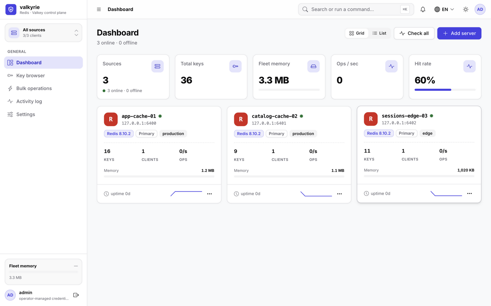
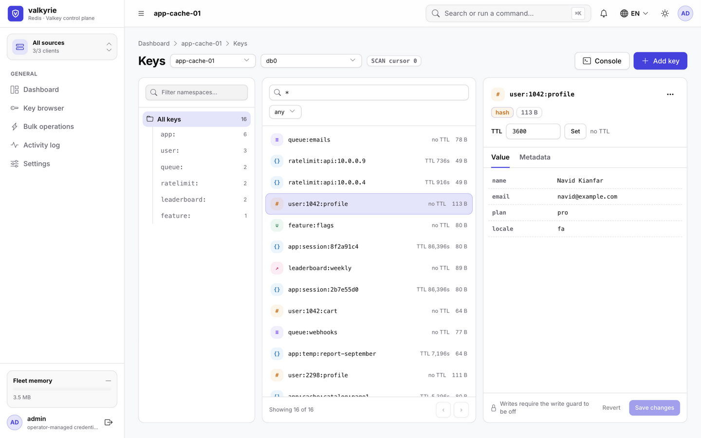
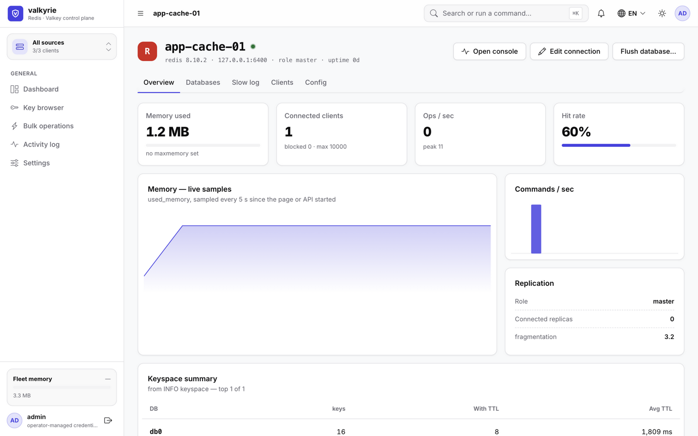
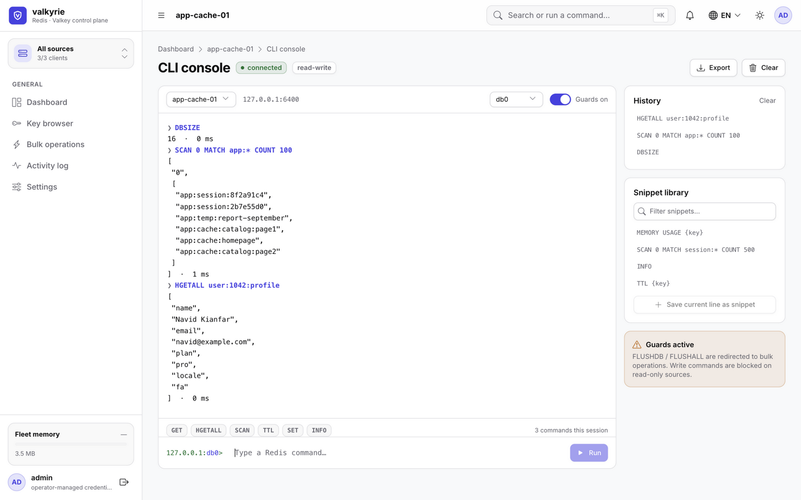
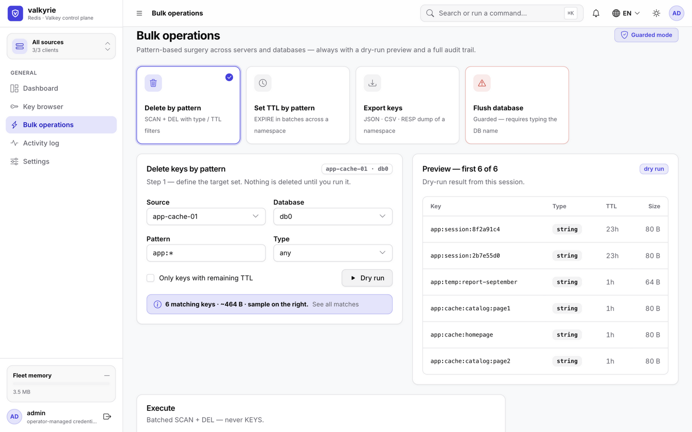
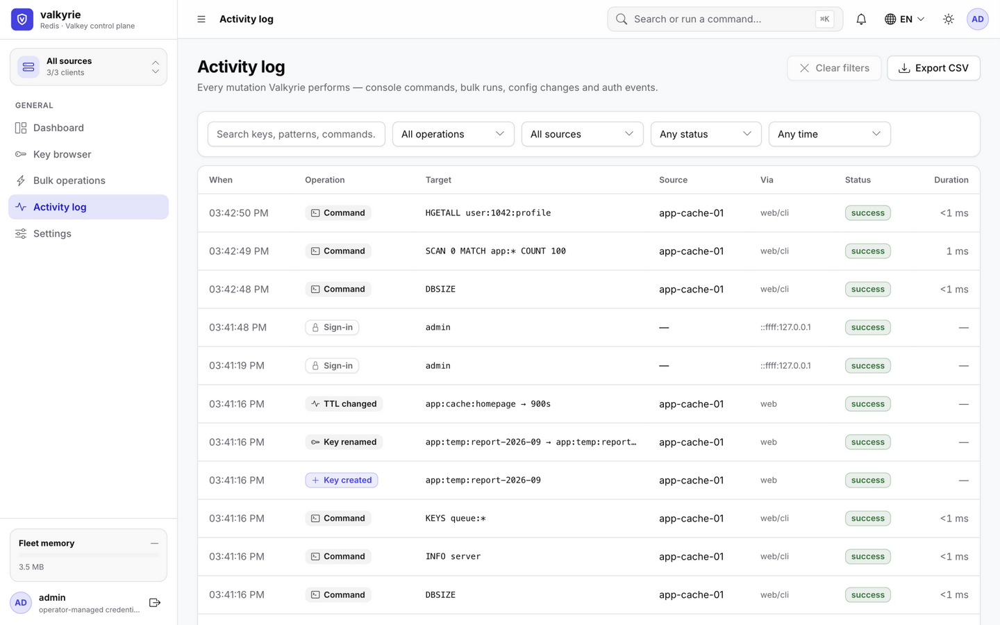
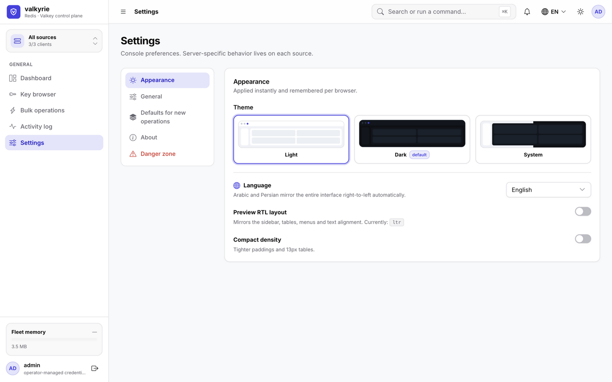
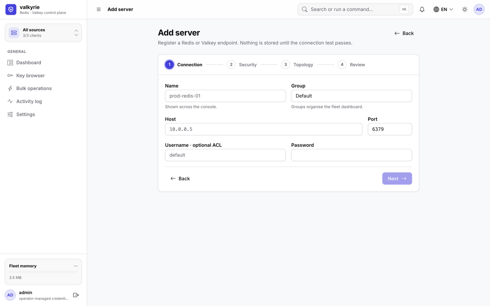
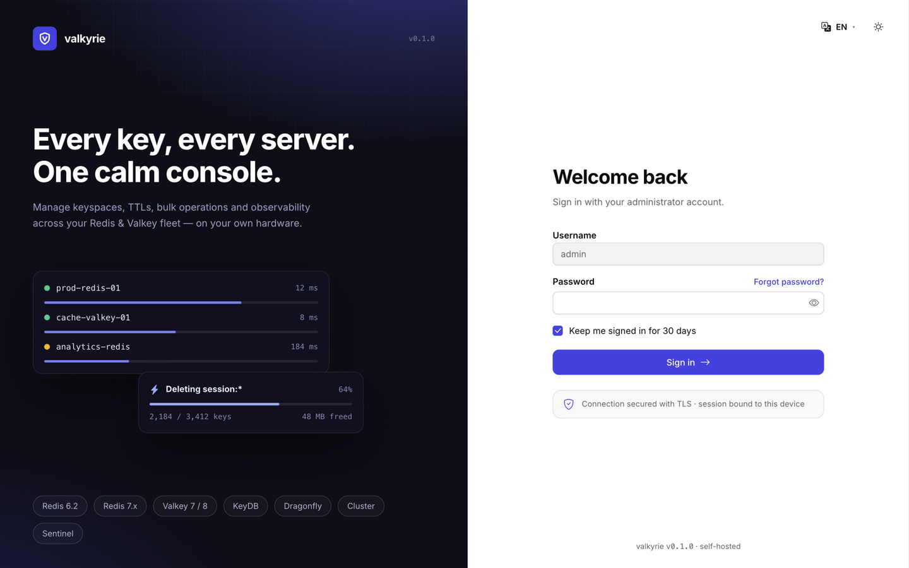
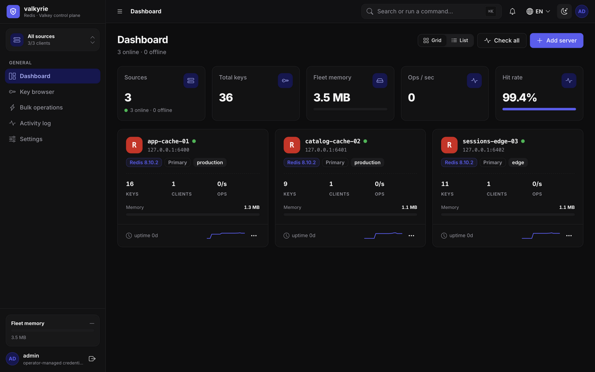

<p align="center">
  
</p>

<h1 align="center">Valkyrie</h1>

<p align="center">
  An on-premise control plane for your Redis and Valkey fleet.<br />
  Browse keyspaces, run commands, perform bulk surgery and keep an audit trail — from one UI, on your own hardware.
</p>

<p align="center">
  
  
  
  
  
  
</p>

---

Valkyrie is a self-hosted Redis/Valkey manager for people who administer a handful of
servers and are tired of `redis-cli` over SSH tunnels. It connects to standalone,
replica, cluster and sentinel deployments, directly or through an SSH jump host, and
puts the day-to-day work — browsing keys, inspecting memory, running commands, expiring
or deleting by pattern — behind one console with a full audit trail.

It is deliberately **single-admin**: there is no user management, no roles, no sign-up.
One account, defined by environment variables, for a tool that sits on your own network.

**Contents**

<!-- TOC -->
- [Screenshots](#screenshots)
- [Features](#features)
- [Quick start](#quick-start)
- [Configuration](#configuration)
- [Images, tags and releases](#images-tags-and-releases)
- [Operating it](#operating-it)
- [Project layout](#project-layout)
- [Development](#development)
- [Security model](#security-model)
- [CI/CD](#cicd)
- [Tech stack](#tech-stack)
- [License](#license)

## Screenshots

The fleet dashboard — every source, its memory, client count and live sparkline:



<details>
<summary><b>Key browser</b> — namespace tree, type-aware inspector, TTL control</summary>



</details>

<details>
<summary><b>Source overview</b> — live memory samples, keyspace summary, replication</summary>



</details>

<details>
<summary><b>CLI console</b> — command history, snippet library, dangerous-command guards</summary>



</details>

<details>
<summary><b>Bulk operations</b> — always a dry-run preview first, never <code>KEYS</code></summary>



</details>

<details>
<summary><b>Activity log</b> — every mutation, with filters and CSV export</summary>



</details>

<details>
<summary><b>Settings</b> — theme, four languages, RTL preview, compact density</summary>



</details>

<details>
<summary><b>Add-source wizard</b> — connection, security, topology, review</summary>



</details>

<details>
<summary><b>Sign-in</b> and the <b>dark theme</b></summary>





</details>

## Features

**Sources**

- Standalone, replica, cluster and sentinel topologies.
- Plain, TLS (with a custom CA, SNI, or verification disabled) and SSH-tunnelled
  connections, including key-based SSH auth.
- Per-source safety rails: mark a source **read-only** so writes are refused, and keep
  the **dangerous-command guard** on to intercept `FLUSHALL` and friends.
- Group sources into a fleet view, and set the `SCAN` batch size and how many databases
  to expose.

**Keys**

- Three-pane browser: namespace tree → filtered key list → type-aware editor for strings,
  hashes, lists, sets, sorted sets and streams.
- TTL display on every row, with set/clear from the inspector; rename, create and delete
  keys without leaving the page.
- Namespace grouping derives from the key prefix, so `app:cache:*` rolls up on its own.

**Operations**

- **CLI console** with history, a reusable snippet library, a database selector
  (`db0`–`db15`), and export of the session transcript.
- **Bulk operations** for delete-by-pattern, set-TTL-by-pattern and export
  (JSON / CSV / RESP), each with a dry-run preview and a cancellable background job.
  Deletion batches `SCAN` + `DEL`; it never issues `KEYS`.
- **Flush database** behind a type-the-database-name confirmation.
- **Activity log** recording console commands, key mutations, bulk runs, source changes
  and auth events, filterable and exportable to CSV.

**Interface**

- Dark, light and system themes; compact density for dense tables.
- English, Arabic, Persian and Turkish, with automatic right-to-left mirroring and an RTL
  preview toggle so LTR locales can be checked against a mirrored layout.
- Command palette on <kbd>⌘</kbd>/<kbd>Ctrl</kbd>+<kbd>K</kbd>.

## Quick start

### Docker

The published image has the API and the web app inside it, so this is the whole
deployment — one container, one port, one volume.

```bash
docker run -d \
  --name valkyrie \
  --restart unless-stopped \
  -p 8080:4000 \
  -e JWT_SECRET="$(openssl rand -base64 36)" \
  -e ADMIN_USER=admin \
  -e ADMIN_PASSWORD='pick-a-real-password' \
  -v valkyrie-data:/app/data \
  kianfar/valkyrie:latest
```

Then open <http://localhost:8080> and sign in.

> **`JWT_SECRET` and `ADMIN_PASSWORD` are not optional in practice.** The first signs
> session tokens *and* derives the key that encrypts stored source credentials; the
> second is the only way into the UI. See [Configuration](#configuration).

### Docker Compose

Compose reads `.env` for you, which keeps the secrets out of your shell history:

```bash
cp .env.example .env     # then fill in JWT_SECRET and ADMIN_PASSWORD
docker compose up -d
```

```yaml
services:
  valkyrie:
    image: kianfar/valkyrie:latest
    ports:
      - "8080:4000"
    volumes:
      - valkyrie-data:/app/data
    environment:
      JWT_SECRET: ${JWT_SECRET:?set JWT_SECRET in .env}
      ADMIN_USER: ${ADMIN_USER:-admin}
      ADMIN_PASSWORD: ${ADMIN_PASSWORD:?set ADMIN_PASSWORD in .env}
    restart: unless-stopped

volumes:
  valkyrie-data:
```

### Build the image yourself

```bash
docker build -t valkyrie .
docker run -d -p 8080:4000 \
  -e JWT_SECRET="$(openssl rand -base64 36)" \
  -e ADMIN_PASSWORD='pick-a-real-password' \
  -v valkyrie-data:/app/data valkyrie
```

The build is multi-stage and per-architecture; the runtime image carries production
dependencies only, runs as the non-root `node` user, and has a `HEALTHCHECK` against
`/api/health`.

### From source

Node 22+ and pnpm 12.

```bash
git clone git@github.com:navid-kianfar/valkyrie.git
cd valkyrie
pnpm install
cp apps/api/.env.example apps/api/.env     # then edit it
pnpm dev                                    # API on :4000, web on :5173
```

Open <http://localhost:5173>. Vite serves the SPA and proxies `/api` to the API.

`pnpm dev:redis` starts a throwaway Redis on `:6399` (via `redis-memory-server`) if you
need something to point a source at. Pointing one at a real Redis works too — that is the
point.

## Configuration

Everything is environment-driven; there is no config file and no settings UI for these.

| Variable | Default | Notes |
|---|---|---|
| `JWT_SECRET` | dev fallback | **Required in production**, at least 16 characters. Signs session tokens and derives (via scrypt) the AES-256-GCM key that encrypts stored source passwords and SSH keys. Changing it invalidates all sessions and makes saved credentials unreadable. |
| `ADMIN_PASSWORD` | `valkyrie` | **Set this.** The single admin account; there is no user management by design. |
| `ADMIN_USER` | `admin` | Username for that account. |
| `PORT` | `4000` | The container's listening port. |
| `DB_PATH` | `data/valkyrie.db` | SQLite file. The image sets this to `/app/data/valkyrie.db`. |
| `NODE_ENV` | `development` | `production` enforces the `JWT_SECRET` requirement. The image sets it. |
| `WEB_DIST` | `./web` | Where the API looks for the built SPA. Set by the image; leave alone. |

The admin credential is synced from the environment on every boot, so changing
`ADMIN_PASSWORD` and restarting rotates it. Sessions last 1 day, or 30 days when
"Keep me signed in" is ticked.

## Images, tags and releases

Images are published to Docker Hub as **`kianfar/valkyrie`** for `linux/amd64` and
`linux/arm64`, as a single multi-arch manifest list.

| Tag | Meaning |
|---|---|
| `latest` | Newest stable release. |
| `1.4.0` | An exact version — **pin this in production**. |
| `1.4` | Newest patch of that minor. |

Cut a release by pushing a `v*` tag, which builds and publishes the images and opens the
GitHub Release:

```bash
git tag v0.1.0
git push origin v0.1.0
```

Pre-release tags (`v0.2.0-rc1`) publish their own version tags but never move `:latest`.

To upgrade a deployment:

```bash
docker compose pull && docker compose up -d
```

Database migrations are applied automatically at boot from the `drizzle/` folder baked
into the image, so there is no separate migration step.

## Operating it

**Data.** Everything Valkyrie persists lives in the `/app/data` volume — the SQLite
database holding sources, the encrypted credentials, the activity log and settings.
Removing the container without removing the volume keeps all of it.

**Backups.** The volume is a single SQLite file, so a file copy is a valid backup:

```bash
docker run --rm \
  -v valkyrie-data:/data \
  -v "$PWD:/backup" \
  alpine tar czf /backup/valkyrie-$(date +%F).tgz -C /data .
```

**Reverse proxies.** Valkyrie speaks plain HTTP and expects to be reached over a trusted
network. Terminate TLS in front of it (nginx, Caddy, Traefik) if it is exposed beyond
localhost. CORS is open, so the app can be reached under whatever hostname the proxy
serves.

**Resource use.** The API holds one Redis connection per active source plus one SSH
client per tunnelled source. The background health poll runs every 5 seconds by default;
Settings → General turns it off or back on, and also controls whether console commands
are recorded with their arguments in the activity log.

**Health.** `GET /api/health` returns `{"status":"ok"}` and backs the image's
`HEALTHCHECK`.

## Project layout

```
apps/api          NestJS API — Drizzle over SQLite, ioredis, ssh2
  src/auth        single-admin login, JWT, scrypt password hashing
  src/sources     source CRUD, connection tests, network scan
  src/keys        key scan/read/write, TTL, rename, export
  src/bulk        background delete/expire jobs with dry runs
  src/redis       connection pool, SSH tunnels, INFO parsing, sampling
  src/activity    audit log
  src/settings    logCommands, pollSeconds
  drizzle         SQL migrations, applied at boot
apps/web          React 19 + Vite SPA — Tailwind, shadcn/Radix, 4 locales
packages/shared   Types shared by both; source-only, erased at runtime
screenshots       The images used above
```

The API serves the built SPA when it finds one, which is what makes the production
deployment a single process. Under `pnpm dev` it does not — Vite serves the SPA instead.

## Development

| Command | What it does |
|---|---|
| `pnpm dev` | API and web together, both watching |
| `pnpm build` | Production build of every workspace |
| `pnpm dev:redis` | Throwaway Redis on `:6399` for local testing |
| `pnpm --filter @valkyrie/api type-check` | `tsc --noEmit` for the API |
| `pnpm --filter @valkyrie/web type-check` | `tsc --noEmit` for the web app |
| `pnpm --filter @valkyrie/api db:generate` | Generate a migration from a schema change |

Migrations live in `apps/api/drizzle` and run automatically on boot. After editing
`apps/api/src/db/schema.ts`, generate one with `db:generate` and commit both the `.sql`
file and the `meta/` snapshot.

The API compiles to `apps/api/dist/apps/api/src/main.js` — the extra path segments come
from the root `tsconfig.json` pulling `packages/shared/src` into the same program, which
moves the output root up. `pnpm --filter @valkyrie/api start` accounts for this.

## Security model

Worth understanding before you point it at production.

- **One account.** Authentication is a single username and password from the
  environment. There is no self-registration, no password reset and no second factor.
  Anyone who reaches the UI can reach every configured source.
- **Credentials at rest** are encrypted with AES-256-GCM under a key derived from
  `JWT_SECRET`, and the admin password is stored as a scrypt hash. The database alone is
  not enough to recover a source password — but `JWT_SECRET` plus the database is, so
  treat both as secrets.
- **Network placement is the real access control.** Run it on a private network or behind
  an authenticating proxy. The default `docker run` above publishes on `0.0.0.0`; bind to
  `127.0.0.1:8080:4000` if only this host should reach it.
- **Write guards are opt-in per source** and worth using on anything you did not set up
  yourself: `read-only` refuses writes outright, and the dangerous-command guard
  redirects `FLUSHALL`/`FLUSHDB` to the guarded bulk flow.
- **The audit log is local.** It records what Valkyrie did, not what anyone did with
  `redis-cli`, and it is stored in the same SQLite file. It is a trail, not a compliance
  system.

## CI/CD

`.github/workflows/ci.yml` runs on every branch push and pull request:

- **checks** — `pnpm install --frozen-lockfile`, `tsc --noEmit` for both apps, then the
  full production build.
- **image** — builds the Dockerfile for `linux/amd64` with no push and no credentials, so
  a pull request from a fork is verified too.

`.github/workflows/release.yml` runs on `v*` tags: it builds each architecture on a
matching runner (`ubuntu-latest` for amd64, `ubuntu-24.04-arm` for arm64), pushes by
digest, merges the digests into one multi-arch manifest list, and only then creates the
GitHub Release. It needs two repository secrets:

| Secret | |
|---|---|
| `DOCKERHUB_USERNAME` | Docker Hub account owning the `kianfar` namespace |
| `DOCKERHUB_TOKEN` | A Docker Hub access token with read/write scope |

## Tech stack

| | |
|---|---|
| API | NestJS 11, TypeScript, Drizzle ORM, better-sqlite3, ioredis, ssh2 |
| Web | React 19, Vite 6, React Router 7, TanStack Query, Tailwind CSS, shadcn/ui on Radix, cmdk, hand-rolled SVG charts, Sonner |
| Storage | SQLite (WAL) in a volume |
| Runtime | Node 22, single container, non-root |

## License

No license file has been added to this repository yet, so all rights are reserved by
default. Decide the terms before distributing it — the sibling
[registry-vault](https://github.com/navid-kianfar/registry-vault) project uses MIT if you
want consistency.
